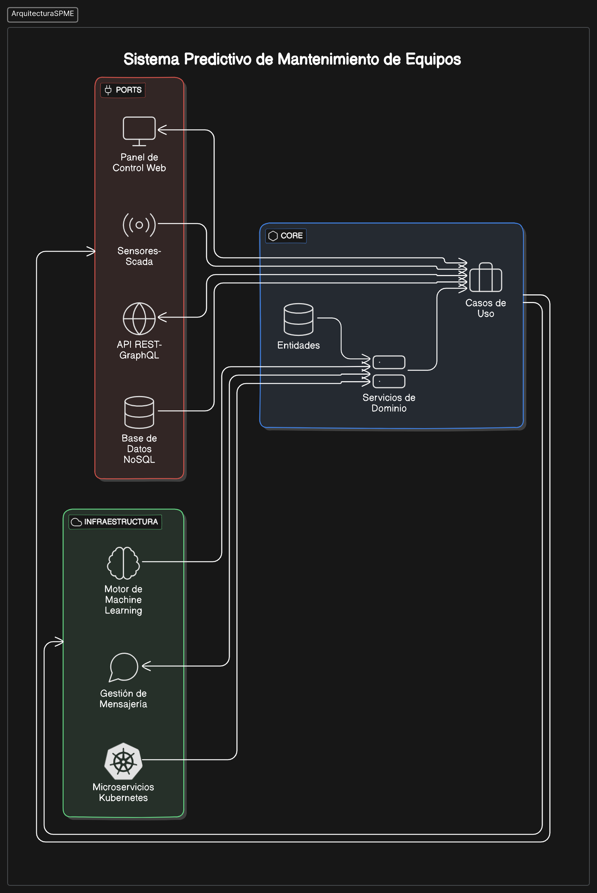
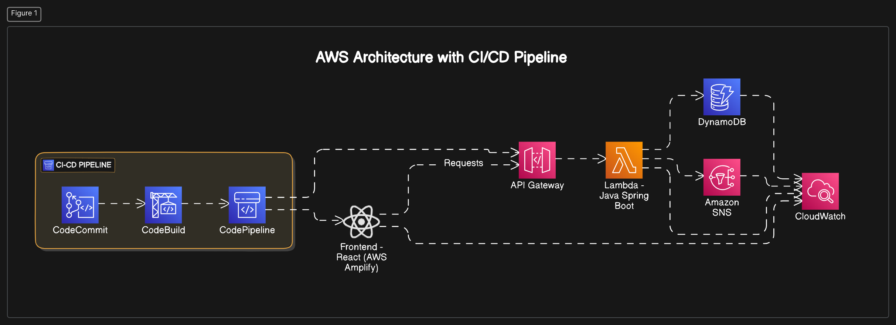
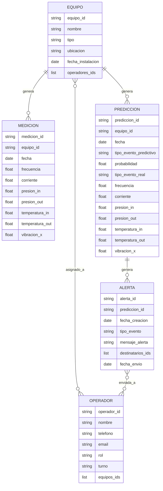

## Índice

0. [Ficha del proyecto](#0-ficha-del-proyecto)
1. [Descripción general del producto](#1-descripción-general-del-producto)
2. [Arquitectura del sistema](#2-arquitectura-del-sistema)
3. [Modelo de datos](#3-modelo-de-datos)
4. [Especificación de la API](#4-especificación-de-la-api)
5. [Historias de usuario](#5-historias-de-usuario)
6. [Tickets de trabajo](#6-tickets-de-trabajo)
7. [Pull requests](#7-pull-requests)

---

## 0. Ficha del proyecto

### **0.1. Autor:** 
Carlos Alberto Lizcano Depablos

### **0.2. Nombre del proyecto:** 
Sistema Predictivo de Mantenimiento de Equipos (SPME)

### **0.3. Descripción breve del proyecto:** 
El **Sistema Predictivo de Mantenimiento de Equipos (SPME)** es una solución avanzada que maximiza la eficiencia operativa y reduce costos mediante monitoreo en tiempo real, análisis predictivo y paneles de control intuitivos. Captura datos de sensores para detectar fallos antes de que ocurran, utiliza inteligencia artificial para predecir problemas futuros y presenta información clave sobre el estado de los equipos. Esto permite una respuesta proactiva, reduce tiempos de inactividad, optimiza la vida útil de los activos y mejora la toma de decisiones basada en datos, asegurando una operación más segura, eficiente y sostenible.

### **0.4. URL del proyecto:**

El proyecto se encuentra publicado en https://github.com/caldep/AI4Devs-finalproject/

### 0.5. URL o archivo comprimido del repositorio

El repositorio se encuentra alojado en GitHub en https://github.com/caldep/AI4Devs-finalproject/

---

## 1. Descripción general del producto

A continuación se presenta una descripción general del producto, incluyendo los objetivos, características y funcionalidades principales, así como la experiencia de usuario y las instrucciones de instalación.

### **1.1. Objetivo:**

Optimizar la gestión de mantenimiento en industrias que dependen de maquinaria crítica, proporcionando un monitoreo continuo y análisis predictivo para anticipar fallos y reducir tiempos de inactividad. El sistema está diseñado para gerentes de mantenimiento, operadores y personal técnico, y su propósito es transformar datos de sensores en información accionable que permita intervenciones preventivas oportunas. Aporta valor al minimizar los costos operativos, mejorar la productividad y alargar la vida útil de los equipos, solucionando problemas de ineficiencia, paros inesperados y altos gastos en reparaciones de emergencia.

### **1.2. Características y funcionalidades principales:**

El **SPME** cuenta con una serie de características y funcionalidades específicas diseñadas para satisfacer las necesidades de mantenimiento eficiente, reducción de tiempos de inactividad y optimización de la vida útil de los equipos. A continuación, se enumeran y describen estas características:

1.2.1. **Captura y Monitoreo de Datos en Tiempo Real**
   - **Descripción**: Recopila datos continuos de sensores instalados en los equipos, como vibración, temperatura, presión, y otros parámetros operativos críticos.
   - **Funcionalidad**: Permite detectar desviaciones de las condiciones normales de operación de forma inmediata, alertando sobre posibles problemas antes de que se conviertan en fallos mayores.
   - **Valor Añadido**: Asegura una supervisión constante de los equipos, lo que contribuye a una rápida identificación de problemas.

1.2.2. **Análisis Predictivo con Inteligencia Artificial**
   - **Descripción**: Utiliza algoritmos avanzados de machine learning para analizar datos históricos y patrones de operación, prediciendo con precisión fallos futuros.
   - **Funcionalidad**: Genera pronósticos sobre el rendimiento de los equipos, identificando piezas o componentes que requieren intervención preventiva.
   - **Valor Añadido**: Reduce los costos asociados con reparaciones inesperadas y prolonga la vida útil de los equipos.

1.2.3. **Alertas y Notificaciones Proactivas**
   - **Descripción**: Envía alertas automáticas y notificaciones personalizadas a técnicos y gerentes cuando se detectan condiciones anómalas o fallos inminentes.
   - **Funcionalidad**: Permite una respuesta rápida y priorización de tareas, evitando daños mayores y tiempos de inactividad prolongados.
   - **Valor Añadido**: Mejora la coordinación del equipo de mantenimiento y optimiza el tiempo de respuesta ante problemas.

1.2.4. **Panel de Control Interactivo e Informes Detallados**
   - **Descripción**: Ofrece una interfaz visual intuitiva que muestra en tiempo real el estado de los equipos, métricas de rendimiento, y predicciones de fallos.
   - **Funcionalidad**: Facilita el acceso a información clave y genera informes detallados que ayudan en la toma de decisiones y planificación del mantenimiento.
   - **Valor Añadido**: Proporciona una visión integral y comprensible de la salud de los equipos, mejorando la gestión y la eficiencia operativa.

1.2.5. **Historial de Mantenimiento y Registro de Eventos**
   - **Descripción**: Almacena un registro completo de todas las intervenciones, fallos y alertas, proporcionando un historial detallado para cada equipo.
   - **Funcionalidad**: Facilita la revisión de patrones de fallos y la efectividad de las acciones tomadas, contribuyendo a mejorar la estrategia de mantenimiento.
   - **Valor Añadido**: Ayuda a realizar un análisis de causa raíz y ajustar los planes de mantenimiento para evitar fallos recurrentes.

### **1.3. Diseño y experiencia de usuario:**

> Proporciona imágenes y/o videotutorial mostrando la experiencia del usuario desde que aterriza en la aplicación, pasando por todas las funcionalidades principales.

### **1.4. Instrucciones de instalación:**
> Documenta de manera precisa las instrucciones para instalar y poner en marcha el proyecto en local (librerías, backend, frontend, servidor, base de datos, migraciones y semillas de datos, etc.)

---

## 2. Arquitectura del Sistema
El modelo de arquitectura propuesto sigue el **Patrón Hexagonal** (o Arquitectura de Puertos y Adaptadores), un enfoque diseñado para separar la lógica de negocio del sistema de sus interfaces externas (como bases de datos, APIs, y sistemas de mensajería), permitiendo una alta cohesión dentro del núcleo de la aplicación y un bajo acoplamiento con el resto de los componentes.

### **2.1. Diagrama de arquitectura:**


*Figura 1:* Diagrama de Arquitectura del SPME

La arquitectura hexagonal se elige para este sistema predictivo de mantenimiento porque aporta flexibilidad, modularidad y la capacidad de gestionar cambios sin impacto significativo en el núcleo del sistema. Aunque implica una complejidad inicial mayor y una curva de aprendizaje más pronunciada, estos sacrificios son compensados por los beneficios a largo plazo en términos de mantenibilidad, escalabilidad y adaptabilidad, especialmente en un entorno industrial donde la capacidad de evolución del sistema es clave para su éxito.


### **2.2. Descripción de componentes principales:**

### **Componentes Clave de la Arquitectura y Tecnologías Utilizadas**

2.2.1. **Panel de Control Web (Frontend)**
   - **Descripción**: Una interfaz web responsiva para la visualización de datos en tiempo real, destinada a operadores técnicos e ingenieros de mantenimiento.
   - **Tecnología**: React.js para la creación de una interfaz dinámica y moderna. La aplicación puede ser alojada en **AWS Amplify**.
   - **Funcionalidad**: Muestra gráficas en tiempo real, métricas clave de los equipos, alertas y notificaciones.

2.2.2. **API REST/GraphQL**
   - **Descripción**: Gestiona las solicitudes del frontend y sirve como puente de comunicación entre los componentes de la lógica de negocio y la interfaz de usuario.
   - **Tecnología**: **AWS API Gateway** La API se desarrollará en Java utilizando Spring Boot, exponiendo endpoints RESTful.
   - **Funcionalidad**: Maneja las solicitudes de monitoreo, obtención de datos históricos y control de las alertas.

2.2.3. **Core de Aplicación (Lógica de Negocio)**
   - **Descripción**: Implementa los servicios de dominio, casos de uso y reglas del sistema predictivo, manejando la interacción con los datos y la ejecución de los modelos predictivos.
   - **Tecnología**: Java con Spring Boot. La lógica de negocio se mantiene independiente de la infraestructura para facilitar cambios y mejoras.
   - **Funcionalidad**: Procesa los datos recibidos, ejecuta los modelos de predicción en formato pickle, y determina las acciones o alertas a generar.

2.2.4. **Motor de Machine Learning**
   - **Descripción**: Carga y ejecución de modelos predictivos preentrenados que se utilizan para analizar los datos en tiempo real.
   - **Tecnología**: **AWS Lambda** para ejecutar código Java encargado de procesar los modelos.
   - **Funcionalidad**: Ejecuta los modelos cada vez que recibe datos nuevos y devuelve predicciones sobre el estado de los equipos.

2.2.5. **Base de Datos NoSQL**
   - **Descripción**: Almacena lecturas de sensores, resultados de predicciones y logs de alertas, facilitando consultas rápidas y escalables.
   - **Tecnología**: **Amazon DynamoDB**, maneja esquemas flexibles, ideales para los datos semiestructurados del sistema.
   - **Funcionalidad**: Gestiona el almacenamiento y recuperación de datos en tiempo real, con opciones para automatizar alertas a través de Streams.

2.2.6. **Gestión de Mensajería y Notificaciones**
   - **Descripción**: Coordina la entrega de notificaciones y alertas a los usuarios cuando se detectan posibles fallos o se superan umbrales críticos.
   - **Tecnología**: **Amazon Simple Notification Service (SNS)** y **Amazon Simple Queue Service (SQS)**, SNS facilita la entrega de alertas por correo o SMS.
   - **Funcionalidad**: Distribuye notificaciones a los usuarios finales de forma eficiente y confiable.

2.2.7. **Seguridad y Cifrado**
   - **Descripción**: Implementación de políticas de seguridad para proteger los datos en tránsito y restringir el acceso no autorizado.
   - **Tecnología**: **AWS Identity and Access Management (IAM)** para gestionar accesos y permisos, y cifrado TLS/SSL en todas las comunicaciones.
   - **Funcionalidad**: Asegura que solo los usuarios autorizados y los servicios con permisos específicos puedan acceder al sistema.

### **2.3. Descripción de alto nivel del proyecto y estructura de ficheros**

```plaintext
├── backend/
│   ├── src/
│   │   ├── main/
│   │   │   ├── java/
│   │   │   │   ├── com.example.mantenimiento/
│   │   │   │   │   ├── application/
│   │   │   │   │   │   ├── service/             # Servicios de aplicación que coordinan los casos de uso.
│   │   │   │   │   │   ├── dto/                 # Objetos de transferencia de datos (Data Transfer Objects).
│   │   │   │   │   │   ├── command/             # Comandos o peticiones que ejecutan casos de uso.
│   │   │   │   │   │
│   │   │   │   │   ├── domain/
│   │   │   │   │   │   ├── model/               # Entidades del dominio y objetos de valor (Value Objects).
│   │   │   │   │   │   ├── repository/          # Interfaces de repositorios para acceso a datos.
│   │   │   │   │   │   ├── event/               # Eventos de dominio.
│   │   │   │   │   │   ├── exception/           # Excepciones de dominio personalizadas.
│   │   │   │   │   │
│   │   │   │   │   ├── infrastructure/
│   │   │   │   │   │   ├── persistence/         # Implementación de los repositorios (uso de ORM como Hibernate).
│   │   │   │   │   │   ├── config/              # Configuraciones del sistema (seguridad, base de datos).
│   │   │   │   │   │   ├── messaging/           # Adaptadores para sistemas de mensajería (SNS, SQS).
│   │   │   │   │   │   ├── api/                 # Controladores REST que exponen los servicios del sistema.
│   │   │   │   │   │   ├── external/            # Integraciones con sistemas externos y adaptadores.
│   │   │   │   │   │
│   │   │   │   │   ├── shared/
│   │   │   │   │   │   ├── util/                # Utilidades comunes y helpers.
│   │   │   │   │   │   ├── mapper/              # Mapeadores para convertir entidades a DTO y viceversa.
│   │   │   │   │
│   │   │   ├── resources/
│   │   │   │   ├── application.yml              # Configuración de la aplicación (DB, seguridad, etc.).
│   │   │   │   ├── logback.xml                  # Configuración de logs.
│   │   │
│   │   ├── test/
│   │   │   ├── java/
│   │   │   │   ├── com.example.mantenimiento/
│   │   │   │   │   ├── application/             # Pruebas de casos de uso y servicios de aplicación.
│   │   │   │   │   ├── domain/                  # Pruebas unitarias de la lógica de negocio (TDD).
│   │   │   │   │   ├── infrastructure/          # Pruebas de integración con adaptadores.
│   │   │   │   │   ├── shared/                  # Pruebas de utilidades y mapeadores.
│   │   │
│   ├── Dockerfile                               # Archivo Docker para la imagen del backend.
│   ├── docker-compose.yml                       # Configuración para la orquestación de contenedores.
│
├── frontend/
│   ├── public/                                  # Archivos públicos del frontend (índices, iconos).
│   ├── src/
│   │   ├── components/                          # Componentes visuales de React.
│   │   ├── pages/                               # Vistas y páginas de la aplicación.
│   │   ├── services/                            # Servicios para la conexión con la API REST.
│   │   ├── hooks/                               # Hooks personalizados de React.
│   │   ├── context/                             # Contextos de React para el manejo del estado global.
│   │   ├── styles/                              # Estilos CSS o SCSS.
│   ├── Dockerfile                               # Archivo Docker para la imagen del frontend.
│
├── .gitignore                                   # Archivo para ignorar archivos no deseados en el control de versiones.
├── README.md                                    # Documentación del proyecto.
└── tests/                                       # Pruebas end-to-end y de integración del sistema completo.
```

#### **2.3.1. Explicación de las Carpetas Principales**

2.3.1.1. **`application/`**: Contiene la capa de aplicación que gestiona los casos de uso y los servicios que coordinan las reglas de negocio. No contiene lógica de dominio sino que sirve de intermediario entre la UI, la infraestructura, y el dominio.

2.3.1.2. **`domain/`**: El corazón de la arquitectura, donde se definen las entidades, repositorios, eventos y excepciones del dominio. Aquí se aplica DDD, modelando la lógica de negocio de forma pura y sin dependencias de infraestructura.

2.3.1.3. **`infrastructure/`**: Aquí se implementan los adaptadores que interactúan con la infraestructura tecnológica. Contiene la configuración de persistencia usando un ORM (como Hibernate), API REST, y los servicios de mensajería.

2.3.1.4. **`shared/`**: Componentes reutilizables, como utilidades, mapeadores y helpers que son compartidos por las demás capas del sistema, asegurando consistencia y evitando la duplicación de código.

2.3.1.5. **`test/`**: Organizada siguiendo TDD, con pruebas para cada capa del sistema: pruebas unitarias para el dominio, de integración para infraestructura y de los casos de uso para la aplicación.

2.3.1.6. **Frontend (`frontend/`)**: Contiene la aplicación React, dividida en componentes, servicios, y hooks. El frontend está diseñado para consumir la API del backend y mostrar los datos en tiempo real, proporcionando una experiencia de usuario intuitiva.

2.3.1.7. **`Dockerfile` y `docker-compose.yml`**: Definen cómo se dockerizan el backend y frontend para una fácil implementación y orquestación, permitiendo que los servicios sean desplegados y administrados en contenedores.

#### **2.3.2. Patrón y Arquitectura Aplicada**

- **Patrón Hexagonal**: Separa la lógica de negocio de la infraestructura, permitiendo independencia y flexibilidad en la integración con tecnologías externas.
- **DDD (Domain-Driven Design)**: Define la estructura del proyecto basada en las reglas y entidades del dominio, asegurando que la lógica de negocio esté bien encapsulada y modular.
- **TDD (Test-Driven Development)**: La estructura de carpetas incluye pruebas desde el inicio, asegurando que cada capa y componente del sistema cumpla con su funcionalidad prevista.

### **2.4. Infraestructura y despliegue**

La infraestructura del proyecto es una arquitectura basada en los servicios de AWS, garantizando una implementación segura, escalable y de alto rendimiento. 

#### **Infraestructura del Proyecto en AWS**


#### **2.4.1. Proceso de Despliegue siguiendo DevSecOps**

2.4.1.1. **Commit y Code Review**: 
   - El código se sube a **AWS CodeCommit**, donde se realiza una revisión de código para verificar la calidad, identificar vulnerabilidades de seguridad, y garantizar el cumplimiento de las prácticas de desarrollo seguro.
   
2.4.1.2. **Construcción y Pruebas Automáticas**: 
   - **AWS CodeBuild** ejecuta la compilación del backend en Java y corre los tests definidos bajo TDD. Para el frontend, se construyen los assets estáticos y se ejecutan pruebas de integración y rendimiento.
   - Se incluyen pruebas de seguridad como análisis de dependencias y escaneo estático del código (SAST) para detectar vulnerabilidades en etapas tempranas.

2.4.1.3. **Despliegue Automatizado**:
   - **AWS CodePipeline** coordina el flujo completo de CI/CD, asegurando que el código que pase las pruebas y revisiones se despliegue automáticamente en los entornos de prueba o producción.
   - Para el backend, se despliega en **AWS Lambda** y se actualiza la configuración de **API Gateway**. El frontend se publica en **AWS Amplify**.

2.4.1.4. **Seguridad Integrada (DevSecOps)**:
   - Se aplican políticas de acceso restringido mediante **IAM**, asegurando que cada componente tenga solo los permisos necesarios.
   - Los datos se cifran en tránsito mediante TLS/SSL, y se habilitan logs detallados en **CloudWatch** para auditoría y monitoreo de seguridad.
   - Se utilizan alertas automatizadas para detectar cualquier actividad sospechosa o fallos en el sistema.

2.4.1.5. **Monitoreo y Alerta**:
   - **Amazon CloudWatch** recopila métricas de rendimiento y logs de aplicación. Se configuran alertas que notifican automáticamente al equipo si se detectan comportamientos anómalos o posibles fallos.
   - Las alertas se envían a través de **SNS**, informando a los responsables de mantenimiento y operación.

### **2.4.2. Beneficios del Enfoque DevSecOps**

- **Automatización Completa**: Minimiza los errores humanos, acelera el tiempo de entrega y asegura que las pruebas y despliegues se realicen de manera consistente.
- **Seguridad Integrada**: Incorpora seguridad en cada etapa del pipeline de CI/CD, desde la codificación hasta la producción, protegiendo los datos y el acceso a los servicios.
- **Resiliencia y Escalabilidad**: Con la arquitectura desacoplada y los servicios manejados de AWS, el sistema es fácil de escalar y puede adaptarse rápidamente a los cambios en la carga.


### **2.5. Seguridad**

> Enumera y describe las prácticas de seguridad principales que se han implementado en el proyecto, añadiendo ejemplos si procede

### **2.6. Tests**

> Describe brevemente algunos de los tests realizados

---

## 3. Modelo de Datos
A continuación se presenta el modelo de datos NoSQL del sistema predictivo de mantenimiento de equipos.

### **3.1. Diagrama del modelo de datos:**



### **3.2. Descripción de entidades principales:**

1. **EQUIPO**: Representa cada equipo monitoreado. 
   - **Atributos**:
     - `equipo_id`: Identificador único del equipo.
     - `nombre`: Nombre del equipo.
     - `tipo`: Tipo de equipo.
     - `ubicacion`: Ubicación física del equipo.
     - `fecha_instalacion`: Fecha en la que el equipo fue instalado.
     - `operadores_ids`: Lista de identificadores de operadores asignados al equipo.
   - **Relaciones**: 
     - Relaciona uno a muchos con `MEDICIÓN` y `PREDICCION`.

2. **MEDICIÓN**: Almacena las mediciones de los sensores en tiempo real.
   - **Atributos**:
     - `medicion_id`: Identificador único del conjunto de datos de mediciones.
     - `equipo_id`: Relación con el equipo del cual se obtienen las mediciones.
     - `fecha`: Fecha y hora en que se tomaron las mediciones.
     - `frecuencia`, `corriente`, `presion_in`, `presion_out`, `temperatura_in`, `temperatura_out`, `vibracion_x`: Valores de las señales capturadas.
   - **Relaciones**: 
     - Relacionado con `EQUIPO` mediante `equipo_id`.

3. **PREDICCION**: Documenta las predicciones de posibles fallos basados en los datos recibidos de los sensores.
   - **Atributos**:
     - `predicion_id`: Identificador único de la predicción.
     - `equipo_id`: Identifica el equipo al que corresponde la predicción.
     - `fecha`: Fecha y hora en la que se realizó la predicción.
     - `tipo_evento_predictivo`: Tipo de evento predicho.
     - `probabilidad`: Probabilidad del evento predicho.
     - `tipo_evento_real`: Evento real que ocurrió.
     - `frecuencia`, `corriente`, `presion_in`, `presion_out`, `temperatura_in`, `temperatura_out`, `vibracion_x`: Valores que acompañaron la predicción para referencias y análisis posteriores.
   - **Relaciones**: 
     - Relacionado con `EQUIPO` y `ALERTA`.

4. **ALERTA**: Registro de las alertas generadas por las predicciones.
   - **Atributos**:
     - `alerta_id`: Identificador único de la alarma.
     - `prediccion_id`: Relación con la predicción que disparó la alarma.
     - `fecha_creacion`: Fecha en que se creó la alarma.
     - `tipo_evento`: Tipo de evento que generó la alarma.
     - `mensaje_alerta`: Descripción o mensaje de la alerta enviada.
     - `destinatarios_ids`: Lista de destinatarios de la alarma.
     - `fecha_envio`: Fecha en que se envió la alerta.
   - **Relaciones**: 
     - Relacionada con `PREDICCION` por `prediccion_id`.
     - Relacionada con `OPERADOR` por `operadores_ids`.

5. **OPERADOR**: Personal de mantenimiento del equipo.
   - **Atributos**:
     - `operador_id`: Identificador único del operador.
     - `nombre`: nombre del operador.
     - `telefono`: número de teléfono del operador.
     - `email`: correo electrónico del operador.
     - `rol`: responsabilidad del operador en el mantenimiento.
     - `equipos_ids`: Lista de equipos asignados.
   - **Relaciones**: 
     - Relacionada con `EQUIPO` por `equipos_ids`.
     - Relacionada con `ALERTA` por `destinatarios_ids`.

### Justificación del Modelo:

- **Eficiencia de Consultas**: Diseñado para consultas rápidas y eficientes, clave en un sistema que opera en tiempo real y necesita acceder rápidamente a datos históricos y predicciones.
- **Escalabilidad**: El diseño permite la fácil incorporación de nuevos tipos de eventos, sensores, o equipos sin grandes cambios estructurales.
- **Seguridad y Control**: Cada documento está relacionado con el mínimo de datos necesarios, lo que facilita políticas de acceso basadas en necesidades específicas.


---

## 4. Especificación de la API

A continuación se describen los principales endpoints de la API RESTful del sistema predictivo de mantenimiento de equipos.

```yaml
openapi: 3.0.0
info:
  title: API Sistema Predictivo de Mantenimiento de Equipos
  version: 1.0.0
  description: API para gestionar equipos, mediciones y predicciones del sistema predictivo de mantenimiento de equipos.

paths:
  /equipos:
    get:
      summary: Obtener todos los equipos
      description: Retorna una lista de todos los equipos con sus detalles.
      parameters:
        - in: query
          name: page
          schema:
            type: integer
          description: Página de los resultados a obtener.
        - in: query
          name: size
          schema:
            type: integer
          description: Cantidad de resultados por página.
        - in: query
          name: sort
          schema:
            type: string
          description: Criterio de ordenamiento (e.g., nombre, tipo).
      responses:
        '200':
          description: Lista de equipos obtenida exitosamente.
        '500':
          description: Error interno del servidor.

    post:
      summary: Crear un nuevo equipo
      description: Registra un nuevo equipo en el sistema.
      requestBody:
        required: true
        content:
          application/json:
            schema:
              type: object
              properties:
                nombre:
                  type: string
                  example: Compresor A
                tipo:
                  type: string
                  example: Compresor
                ubicacion:
                  type: string
                  example: Planta Norte
                fecha_instalacion:
                  type: string
                  format: date
                  example: 2023-08-01
      responses:
        '201':
          description: Equipo creado exitosamente.
        '400':
          description: Datos de entrada inválidos.
        '500':
          description: Error interno del servidor.

  /mediciones:
    get:
      summary: Obtener mediciones de los equipos
      description: Devuelve una lista de mediciones para los equipos registrados, con soporte para paginación y filtros.
      parameters:
        - in: query
          name: equipo_id
          schema:
            type: string
          description: ID del equipo para filtrar mediciones.
        - in: query
          name: fecha_inicio
          schema:
            type: string
            format: date
          description: Fecha de inicio del rango de consulta.
        - in: query
          name: fecha_fin
          schema:
            type: string
            format: date
          description: Fecha de fin del rango de consulta.
      responses:
        '200':
          description: Lista de mediciones obtenida exitosamente.
        '500':
          description: Error interno del servidor.

    post:
      summary: Registrar una nueva medición
      description: Añade una nueva medición de los sensores para un equipo específico.
      requestBody:
        required: true
        content:
          application/json:
            schema:
              type: object
              properties:
                equipo_id:
                  type: string
                  example: 12345
                fecha:
                  type: string
                  format: date-time
                  example: 2024-08-29T14:00:00Z
                frecuencia:
                  type: number
                  format: float
                  example: 50.0
                corriente:
                  type: number
                  format: float
                  example: 10.0
                presion_in:
                  type: number
                  format: float
                  example: 2.5
                presion_out:
                  type: number
                  format: float
                  example: 3.0
                temperatura_in:
                  type: number
                  format: float
                  example: 60.0
                temperatura_out:
                  type: number
                  format: float
                  example: 65.0
                vibracion_x:
                  type: number
                  format: float
                  example: 0.5
      responses:
        '201':
          description: Medición registrada exitosamente.
        '400':
          description: Datos de entrada inválidos.
        '500':
          description: Error interno del servidor.

  /predicciones:
    get:
      summary: Obtener predicciones
      description: Retorna una lista de predicciones generadas por el sistema, filtradas por equipo o rango de fechas.
      parameters:
        - in: query
          name: equipo_id
          schema:
            type: string
          description: ID del equipo para filtrar predicciones.
        - in: query
          name: fecha_inicio
          schema:
            type: string
            format: date
          description: Fecha de inicio del rango de consulta.
        - in: query
          name: fecha_fin
          schema:
            type: string
            format: date
          description: Fecha de fin del rango de consulta.
      responses:
        '200':
          description: Lista de predicciones obtenida exitosamente.
        '500':
          description: Error interno del servidor.

    post:
      summary: Crear una nueva predicción
      description: Añade una nueva predicción basada en las mediciones recientes de un equipo.
      requestBody:
        required: true
        content:
          application/json:
            schema:
              type: object
              properties:
                equipo_id:
                  type: string
                  example: 12345
                fecha:
                  type: string
                  format: date-time
                  example: 2024-08-29T14:00:00Z
                tipo_evento_predictivo:
                  type: string
                  example: Fallo de Motor
                probabilidad:
                  type: number
                  format: float
                  example: 0.85
                tipo_evento_real:
                  type: string
                  example: Operación Normal
                frecuencia:
                  type: number
                  format: float
                  example: 50.0
                corriente:
                  type: number
                  format: float
                  example: 10.0
                presion_in:
                  type: number
                  format: float
                  example: 2.5
                presion_out:
                  type: number
                  format: float
                  example: 3.0
                temperatura_in:
                  type: number
                  format: float
                  example: 60.0
                temperatura_out:
                  type: number
                  format: float
                  example: 65.0
                vibracion_x:
                  type: number
                  format: float
                  example: 0.5
      responses:
        '201':
          description: Predicción creada exitosamente.
        '400':
          description: Datos de entrada inválidos.
        '500':
          description: Error interno del servidor.
```

### Descripción de los Endpoints:

1. **/equipos**:
   - **GET**: Lista todos los equipos, con soporte para paginación y ordenamiento.
   - **POST**: Permite registrar un nuevo equipo con sus detalles básicos.

2. **/mediciones**:
   - **GET**: Obtiene las mediciones de los sensores de los equipos, con posibilidad de filtrar por rango de fechas y por equipo.
   - **POST**: Registra una nueva medición de los sensores para un equipo específico.

3. **/predicciones**:
   - **GET**: Lista las predicciones generadas, permitiendo filtrar por equipo o rango de fechas.
   - **POST**: Crea una nueva predicción basada en las mediciones recientes de un equipo.


---

## 5. Historias de Usuario

A continuación se presentan las principales historias de usuario para el sistema predictivo de mantenimiento de equipos.

### Historia de Usuario 1: Captura de Datos en Tiempo Real

**Título de la Historia de Usuario:**
Captura de Datos en Tiempo Real

**Como** operador,
**quiero** capturar datos de sensores en tiempo real,
**para que** pueda monitorear continuamente el estado de los equipos y detectar desviaciones operativas de inmediato.

**Criterios de Aceptación:**
- Los datos de sensores (vibración, temperatura, presión, etc.) deben ser capturados y almacenados en tiempo real.
- La captura de datos debe ser precisa y reflejar los valores actuales de los sensores.
- Los datos deben ser accesibles para su análisis posterior.

**Notas Adicionales:**
- Los datos capturados deben ser números reales y almacenados en una base de datos NoSQL.
- La arquitectura debe seguir el Patrón Hexagonal para asegurar la independencia de la lógica de negocio.

**Historias de Usuario Relacionadas:**
- Análisis Predictivo
- Visualización en el Panel de Control

**Prioridad:**
Alta

---

### Historia de Usuario 2: Análisis Predictivo

**Título de la Historia de Usuario:**
Análisis Predictivo

**Como** operador,
**quiero** que el sistema analice los datos capturados utilizando modelos predictivos,
**para que** pueda anticipar fallos futuros y tomar acciones preventivas.

**Criterios de Aceptación:**
- El sistema debe ejecutar análisis predictivo utilizando modelos entrenados en formato pickle.
- Los resultados del análisis deben incluir predicciones de fallos con su probabilidad asociada.
- Las predicciones deben ser almacenadas y estar disponibles para su consulta.

**Notas Adicionales:**
- Los modelos predictivos deben ser ejecutados en AWS Lambda.
- La arquitectura debe permitir la integración de nuevos modelos sin afectar la lógica de negocio.

**Historias de Usuario Relacionadas:**
- Captura de Datos en Tiempo Real
- Visualización en el Panel de Control

**Prioridad:**
Alta

---

### Historia de Usuario 3: Visualización en el Panel de Control

**Título de la Historia de Usuario:**
Visualización en el Panel de Control

**Como** operador,
**quiero** visualizar los datos de sensores y predicciones en un panel de control interactivo,
**para que** pueda monitorear las tendencias y recibir alertas visuales sobre posibles fallos.

**Criterios de Aceptación:**
- El panel de control debe mostrar series de tiempo de los datos de sensores.
- Las predicciones de fallos deben ser visualizadas con indicadores de alerta.
- El panel debe ser interactivo y permitir la exploración de datos históricos.

**Notas Adicionales:**
- La interfaz debe ser desarrollada en React.js y alojada en AWS Amplify.
- La arquitectura debe asegurar que el frontend pueda consumir datos de la API REST/GraphQL de manera eficiente.

**Historias de Usuario Relacionadas:**
- Captura de Datos en Tiempo Real
- Análisis Predictivo

**Prioridad:**
Alta

---

## 6. Tickets de Trabajo

A continuación se presentan los tickets de trabajo principales para la implementación de las tres historias de usuario.

### Tickets de la Historia de Usuario 1: Captura de Datos en Tiempo Real

#### Ticket 1: Definir Entidades y Repositorios del Dominio

**Descripción:**
Crear las entidades y repositorios necesarios para la captura de datos en tiempo real, siguiendo el patrón DDD.

**Tareas:**
1. Crear la entidad `Medicion` con los atributos necesarios (frecuencia, corriente, presión, temperatura, vibración, etc.).
2. Definir el repositorio de `Medicion` para la persistencia de datos.
3. Implementar las interfaces de repositorio en la capa de dominio.

**Criterios de Aceptación:**
- La entidad `Medicion` debe estar correctamente definida con todos los atributos necesarios.
- El repositorio de `Medicion` debe permitir operaciones CRUD básicas.
- Las pruebas unitarias deben estar implementadas para validar la creación y persistencia de `Medicion`.

**Notas Adicionales:**
- Utilizar una base de datos NoSQL (Amazon DynamoDB) para la persistencia de las mediciones.

---

#### Ticket 2: Implementar Servicios de Aplicación

**Descripción:**
Desarrollar los servicios de aplicación que gestionen la captura y almacenamiento de datos en tiempo real.

**Tareas:**
1. Crear un servicio de aplicación para gestionar la captura de datos de sensores.
2. Implementar métodos en el servicio para recibir y almacenar las mediciones.
3. Asegurar que el servicio interactúe correctamente con el repositorio de `Medicion`.

**Criterios de Aceptación:**
- El servicio de aplicación debe permitir la captura y almacenamiento de datos en tiempo real.
- Las pruebas unitarias deben estar implementadas para validar la funcionalidad del servicio.

**Notas Adicionales:**
- Seguir el patrón DDD para mantener la separación de responsabilidades.

---

#### Ticket 3: Desarrollar API REST para Captura de Datos

**Descripción:**
Crear los endpoints necesarios en la API REST para permitir la captura de datos en tiempo real desde los sensores.

**Tareas:**
1. Definir el endpoint POST `/mediciones` para recibir datos de sensores.
2. Implementar el controlador REST que maneje las solicitudes de captura de datos.
3. Validar y transformar los datos recibidos antes de almacenarlos.

**Criterios de Aceptación:**
- El endpoint `/mediciones` debe aceptar datos de sensores y almacenarlos correctamente.
- Las pruebas unitarias y de integración deben estar implementadas para validar el endpoint.

**Notas Adicionales:**
- Utilizar Spring Boot para la implementación de la API REST.

---

#### Ticket 4: Configurar Persistencia en DynamoDB

**Descripción:**
Configurar la persistencia de datos en Amazon DynamoDB para almacenar las mediciones capturadas.

**Tareas:**
1. Configurar la conexión a DynamoDB en la aplicación.
2. Definir las tablas necesarias para almacenar las mediciones.
3. Implementar la lógica de persistencia en el repositorio de `Medicion`.

**Criterios de Aceptación:**
- La aplicación debe estar correctamente configurada para interactuar con DynamoDB.
- Las mediciones deben ser almacenadas y recuperadas correctamente desde DynamoDB.
- Las pruebas unitarias deben validar la persistencia en DynamoDB.

**Notas Adicionales:**
- Asegurar que la configuración siga las mejores prácticas de seguridad y rendimiento.

---

#### Ticket 5: Implementar Pruebas de Integración

**Descripción:**
Desarrollar pruebas de integración para asegurar que la captura de datos en tiempo real funcione correctamente en todo el sistema.

**Tareas:**
1. Crear pruebas de integración para el endpoint `/mediciones`.
2. Validar que los datos capturados se almacenen correctamente en DynamoDB.
3. Asegurar que el servicio de aplicación y el repositorio interactúen correctamente.

**Criterios de Aceptación:**
- Las pruebas de integración deben cubrir todos los casos de uso de la captura de datos en tiempo real.
- Las pruebas deben pasar exitosamente, validando la funcionalidad completa del sistema.

**Notas Adicionales:**
- Utilizar un entorno de pruebas que simule la configuración de producción.

---

#### Ticket 6: Documentar la Funcionalidad

**Descripción:**
Documentar la funcionalidad de captura de datos en tiempo real, incluyendo la API, el modelo de datos y las pruebas.

**Tareas:**
1. Documentar el endpoint `/mediciones` en la especificación de la API.
2. Incluir ejemplos de solicitudes y respuestas.
3. Documentar el modelo de datos `Medicion` y su persistencia en DynamoDB.
4. Incluir una guía para ejecutar las pruebas unitarias y de integración.

**Criterios de Aceptación:**
- La documentación debe ser clara y completa, permitiendo a otros desarrolladores entender y utilizar la funcionalidad.
- La documentación debe incluir ejemplos y guías detalladas.

**Notas Adicionales:**
- Asegurar que la documentación esté actualizada y accesible en el repositorio del proyecto.

---


### Tickets de la Historia de Usuario 2: Análisis Predictivo

#### Ticket 1: Definir Entidades y Repositorios del Dominio

**Descripción:**
Crear las entidades y repositorios necesarios para el análisis predictivo, siguiendo el patrón DDD.

**Tareas:**
1. Crear la entidad `Prediccion` con los atributos necesarios (equipo_id, fecha, tipo_evento_predictivo, probabilidad, etc.).
2. Definir el repositorio de `Prediccion` para la persistencia de datos.
3. Implementar las interfaces de repositorio en la capa de dominio.

**Criterios de Aceptación:**
- La entidad `Prediccion` debe estar correctamente definida con todos los atributos necesarios.
- El repositorio de `Prediccion` debe permitir operaciones CRUD básicas.
- Las pruebas unitarias deben estar implementadas para validar la creación y persistencia de `Prediccion`.

**Notas Adicionales:**
- Utilizar una base de datos NoSQL (Amazon DynamoDB) para la persistencia de las predicciones.

---

#### Ticket 2: Implementar Servicios de Aplicación

**Descripción:**
Desarrollar los servicios de aplicación que gestionen el análisis predictivo utilizando modelos entrenados en formato pickle.

**Tareas:**
1. Crear un servicio de aplicación para gestionar la ejecución de modelos predictivos.
2. Implementar métodos en el servicio para recibir datos de sensores y generar predicciones.
3. Asegurar que el servicio interactúe correctamente con el repositorio de `Prediccion`.

**Criterios de Aceptación:**
- El servicio de aplicación debe permitir la ejecución de modelos predictivos y la generación de predicciones.
- Las pruebas unitarias deben estar implementadas para validar la funcionalidad del servicio.

**Notas Adicionales:**
- Seguir el patrón DDD para mantener la separación de responsabilidades.

---

#### Ticket 3: Desarrollar API REST para Análisis Predictivo

**Descripción:**
Crear los endpoints necesarios en la API REST para permitir la ejecución de análisis predictivo y la consulta de predicciones.

**Tareas:**
1. Definir el endpoint POST `/predicciones` para recibir datos de sensores y generar predicciones.
2. Definir el endpoint GET `/predicciones` para consultar predicciones históricas.
3. Implementar los controladores REST que manejen las solicitudes de análisis predictivo.

**Criterios de Aceptación:**
- El endpoint `/predicciones` debe aceptar datos de sensores y generar predicciones correctamente.
- El endpoint `/predicciones` debe permitir la consulta de predicciones históricas.
- Las pruebas unitarias y de integración deben estar implementadas para validar los endpoints.

**Notas Adicionales:**
- Utilizar Spring Boot para la implementación de la API REST.

---

#### Ticket 4: Integrar Modelos Predictivos en AWS Lambda

**Descripción:**
Configurar la ejecución de modelos predictivos en AWS Lambda para analizar los datos en tiempo real.

**Tareas:**
1. Configurar AWS Lambda para ejecutar los modelos predictivos en formato pickle.
2. Implementar la lógica para invocar AWS Lambda desde el servicio de aplicación.
3. Asegurar que los resultados de las predicciones se almacenen correctamente en el repositorio de `Prediccion`.

**Criterios de Aceptación:**
- AWS Lambda debe estar correctamente configurado para ejecutar los modelos predictivos.
- El servicio de aplicación debe poder invocar AWS Lambda y recibir los resultados de las predicciones.
- Las predicciones deben ser almacenadas correctamente en DynamoDB.
- Las pruebas unitarias deben validar la integración con AWS Lambda.

**Notas Adicionales:**
- Asegurar que la configuración siga las mejores prácticas de seguridad y rendimiento.

---

#### Ticket 5: Implementar Pruebas de Integración

**Descripción:**
Desarrollar pruebas de integración para asegurar que el análisis predictivo funcione correctamente en todo el sistema.

**Tareas:**
1. Crear pruebas de integración para los endpoints `/predicciones`.
2. Validar que los datos de sensores se procesen correctamente y generen predicciones.
3. Asegurar que el servicio de aplicación, AWS Lambda y el repositorio de `Prediccion` interactúen correctamente.

**Criterios de Aceptación:**
- Las pruebas de integración deben cubrir todos los casos de uso del análisis predictivo.
- Las pruebas deben pasar exitosamente, validando la funcionalidad completa del sistema.

**Notas Adicionales:**
- Utilizar un entorno de pruebas que simule la configuración de producción.

---

#### Ticket 6: Documentar la Funcionalidad

**Descripción:**
Documentar la funcionalidad de análisis predictivo, incluyendo la API, el modelo de datos y las pruebas.

**Tareas:**
1. Documentar los endpoints `/predicciones` en la especificación de la API.
2. Incluir ejemplos de solicitudes y respuestas.
3. Documentar el modelo de datos `Prediccion` y su persistencia en DynamoDB.
4. Incluir una guía para ejecutar las pruebas unitarias y de integración.

**Criterios de Aceptación:**
- La documentación debe ser clara y completa, permitiendo a otros desarrolladores entender y utilizar la funcionalidad.
- La documentación debe incluir ejemplos y guías detalladas.

**Notas Adicionales:**
- Asegurar que la documentación esté actualizada y accesible en el repositorio del proyecto.

---

### Tickets de la Historia de Usuario 3: Visualización en el Panel de Control

#### Ticket 1: Definir Componentes de Frontend

**Descripción:**
Crear los componentes de React necesarios para la visualización de datos en el panel de control.

**Tareas:**
1. Crear un componente principal `Dashboard` que actúe como contenedor para los subcomponentes.
2. Crear subcomponentes para mostrar series de tiempo de los datos de sensores (`SensorDataChart`).
3. Crear subcomponentes para mostrar predicciones y alertas (`PredictionsChart`, `AlertsIndicator`).

**Criterios de Aceptación:**
- El componente `Dashboard` debe integrar correctamente los subcomponentes.
- Los subcomponentes deben ser capaces de recibir y mostrar datos de sensores, predicciones y alertas.
- Las pruebas unitarias deben estar implementadas para validar la funcionalidad de cada componente.

**Notas Adicionales:**
- Utilizar librerías de gráficos como Chart.js o D3.js para la visualización de datos.

---

#### Ticket 2: Implementar Servicios de Frontend

**Descripción:**
Desarrollar los servicios de frontend que interactúen con la API para obtener datos de sensores, predicciones y alertas.

**Tareas:**
1. Crear un servicio `SensorDataService` para obtener datos de sensores desde la API.
2. Crear un servicio `PredictionService` para obtener predicciones desde la API.
3. Crear un servicio `AlertService` para obtener alertas desde la API.

**Criterios de Aceptación:**
- Los servicios deben ser capaces de realizar solicitudes HTTP a la API y manejar las respuestas.
- Los servicios deben proporcionar métodos para obtener datos de sensores, predicciones y alertas.
- Las pruebas unitarias deben estar implementadas para validar la funcionalidad de cada servicio.

**Notas Adicionales:**
- Utilizar Axios o Fetch API para realizar las solicitudes HTTP.

---

#### Ticket 3: Desarrollar API REST para Visualización de Datos

**Descripción:**
Crear los endpoints necesarios en la API REST para proporcionar datos de sensores, predicciones y alertas al frontend.

**Tareas:**
1. Definir el endpoint GET `/sensores` para obtener datos de sensores.
2. Definir el endpoint GET `/predicciones` para obtener predicciones.
3. Definir el endpoint GET `/alertas` para obtener alertas.
4. Implementar los controladores REST que manejen las solicitudes de visualización de datos.

**Criterios de Aceptación:**
- Los endpoints deben proporcionar datos de sensores, predicciones y alertas correctamente.
- Las pruebas unitarias y de integración deben estar implementadas para validar los endpoints.

**Notas Adicionales:**
- Utilizar Spring Boot para la implementación de la API REST.

---

#### Ticket 4: Integrar Frontend con Backend

**Descripción:**
Asegurar que el frontend pueda consumir datos de la API REST y mostrar la información en el panel de control.

**Tareas:**
1. Configurar el frontend para consumir los servicios de la API REST.
2. Asegurar que los componentes de React reciban y muestren los datos correctamente.
3. Implementar lógica de actualización en tiempo real para los datos de sensores, predicciones y alertas.

**Criterios de Aceptación:**
- El panel de control debe mostrar datos de sensores, predicciones y alertas en tiempo real.
- Las pruebas de integración deben validar la comunicación entre el frontend y el backend.

**Notas Adicionales:**
- Asegurar que la configuración siga las mejores prácticas de seguridad y rendimiento.

---

#### Ticket 5: Implementar Pruebas de Integración

**Descripción:**
Desarrollar pruebas de integración para asegurar que la visualización en el panel de control funcione correctamente en todo el sistema.

**Tareas:**
1. Crear pruebas de integración para los endpoints `/sensores`, `/predicciones` y `/alertas`.
2. Validar que los datos se muestren correctamente en el panel de control.
3. Asegurar que el frontend y el backend interactúen correctamente.

**Criterios de Aceptación:**
- Las pruebas de integración deben cubrir todos los casos de uso de la visualización en el panel de control.
- Las pruebas deben pasar exitosamente, validando la funcionalidad completa del sistema.

**Notas Adicionales:**
- Utilizar un entorno de pruebas que simule la configuración de producción.

---

#### Ticket 6: Documentar la Funcionalidad

**Descripción:**
Documentar la funcionalidad de visualización en el panel de control, incluyendo la API, los componentes de frontend y las pruebas.

**Tareas:**
1. Documentar los endpoints `/sensores`, `/predicciones` y `/alertas` en la especificación de la API.
2. Incluir ejemplos de solicitudes y respuestas.
3. Documentar los componentes de React y su interacción con los servicios de frontend.
4. Incluir una guía para ejecutar las pruebas unitarias y de integración.

**Criterios de Aceptación:**
- La documentación debe ser clara y completa, permitiendo a otros desarrolladores entender y utilizar la funcionalidad.
- La documentación debe incluir ejemplos y guías detalladas.

**Notas Adicionales:**
- Asegurar que la documentación esté actualizada y accesible en el repositorio del proyecto.

---


---

## 7. Pull Requests

> Documenta 3 de las Pull Requests realizadas durante la ejecución del proyecto

**Pull Request 1**

**Pull Request 2**

**Pull Request 3**

