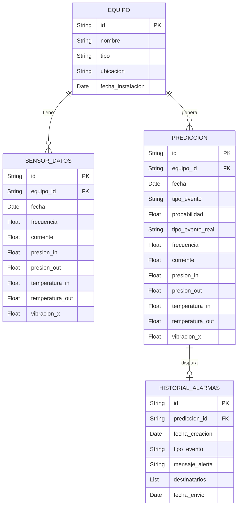

## Índice

0. [Ficha del proyecto](#0-ficha-del-proyecto)
1. [Descripción general del producto](#1-descripción-general-del-producto)
2. [Arquitectura del sistema](#2-arquitectura-del-sistema)
3. [Modelo de datos](#3-modelo-de-datos)
4. [Especificación de la API](#4-especificación-de-la-api)
5. [Historias de usuario](#5-historias-de-usuario)
6. [Tickets de trabajo](#6-tickets-de-trabajo)
7. [Pull requests](#7-pull-requests)

---

## 0. Ficha del proyecto

### **0.1. Autor:** 
Carlos Alberto Lizcano Depablos

### **0.2. Nombre del proyecto:** 
Sistema Predictivo de Mantenimiento de Equipos (SPME)

### **0.3. Descripción breve del proyecto:** 
El **Sistema Predictivo de Mantenimiento de Equipos (SPME)** es una solución avanzada que maximiza la eficiencia operativa y reduce costos mediante monitoreo en tiempo real, análisis predictivo y paneles de control intuitivos. Captura datos de sensores para detectar fallos antes de que ocurran, utiliza inteligencia artificial para predecir problemas futuros y presenta información clave sobre el estado de los equipos. Esto permite una respuesta proactiva, reduce tiempos de inactividad, optimiza la vida útil de los activos y mejora la toma de decisiones basada en datos, asegurando una operación más segura, eficiente y sostenible.

### **0.4. URL del proyecto:**

> Puede ser pública o privada, en cuyo caso deberás compartir los accesos de manera segura. Puedes enviarlos a [alvaro@lidr.co](mailto:alvaro@lidr.co) usando algún servicio como [onetimesecret](https://onetimesecret.com/).

### 0.5. URL o archivo comprimido del repositorio

> Puedes tenerlo alojado en público o en privado, en cuyo caso deberás compartir los accesos de manera segura. Puedes enviarlos a [alvaro@lidr.co](mailto:alvaro@lidr.co) usando algún servicio como [onetimesecret](https://onetimesecret.com/). También puedes compartir por correo un archivo zip con el contenido


---

## 1. Descripción general del producto

A continuación se presenta una descripción general del producto, incluyendo los objetivos, características y funcionalidades principales, así como la experiencia de usuario y las instrucciones de instalación.

### **1.1. Objetivo:**

Optimizar la gestión de mantenimiento en industrias que dependen de maquinaria crítica, proporcionando un monitoreo continuo y análisis predictivo para anticipar fallos y reducir tiempos de inactividad. El sistema está diseñado para gerentes de mantenimiento, operadores y personal técnico, y su propósito es transformar datos de sensores en información accionable que permita intervenciones preventivas oportunas. Aporta valor al minimizar los costos operativos, mejorar la productividad y alargar la vida útil de los equipos, solucionando problemas de ineficiencia, paros inesperados y altos gastos en reparaciones de emergencia.

### **1.2. Características y funcionalidades principales:**

El **SPME** cuenta con una serie de características y funcionalidades específicas diseñadas para satisfacer las necesidades de mantenimiento eficiente, reducción de tiempos de inactividad y optimización de la vida útil de los equipos. A continuación, se enumeran y describen estas características:

1.2.1. **Captura y Monitoreo de Datos en Tiempo Real**
   - **Descripción**: Recopila datos continuos de sensores instalados en los equipos, como vibración, temperatura, presión, y otros parámetros operativos críticos.
   - **Funcionalidad**: Permite detectar desviaciones de las condiciones normales de operación de forma inmediata, alertando sobre posibles problemas antes de que se conviertan en fallos mayores.
   - **Valor Añadido**: Asegura una supervisión constante de los equipos, lo que contribuye a una rápida identificación de problemas.

1.2.2. **Análisis Predictivo con Inteligencia Artificial**
   - **Descripción**: Utiliza algoritmos avanzados de machine learning para analizar datos históricos y patrones de operación, prediciendo con precisión fallos futuros.
   - **Funcionalidad**: Genera pronósticos sobre el rendimiento de los equipos, identificando piezas o componentes que requieren intervención preventiva.
   - **Valor Añadido**: Reduce los costos asociados con reparaciones inesperadas y prolonga la vida útil de los equipos.

1.2.3. **Alertas y Notificaciones Proactivas**
   - **Descripción**: Envía alertas automáticas y notificaciones personalizadas a técnicos y gerentes cuando se detectan condiciones anómalas o fallos inminentes.
   - **Funcionalidad**: Permite una respuesta rápida y priorización de tareas, evitando daños mayores y tiempos de inactividad prolongados.
   - **Valor Añadido**: Mejora la coordinación del equipo de mantenimiento y optimiza el tiempo de respuesta ante problemas.

1.2.4. **Panel de Control Interactivo e Informes Detallados**
   - **Descripción**: Ofrece una interfaz visual intuitiva que muestra en tiempo real el estado de los equipos, métricas de rendimiento, y predicciones de fallos.
   - **Funcionalidad**: Facilita el acceso a información clave y genera informes detallados que ayudan en la toma de decisiones y planificación del mantenimiento.
   - **Valor Añadido**: Proporciona una visión integral y comprensible de la salud de los equipos, mejorando la gestión y la eficiencia operativa.

1.2.5. **Historial de Mantenimiento y Registro de Eventos**
   - **Descripción**: Almacena un registro completo de todas las intervenciones, fallos y alertas, proporcionando un historial detallado para cada equipo.
   - **Funcionalidad**: Facilita la revisión de patrones de fallos y la efectividad de las acciones tomadas, contribuyendo a mejorar la estrategia de mantenimiento.
   - **Valor Añadido**: Ayuda a realizar un análisis de causa raíz y ajustar los planes de mantenimiento para evitar fallos recurrentes.

### **1.3. Diseño y experiencia de usuario:**

> Proporciona imágenes y/o videotutorial mostrando la experiencia del usuario desde que aterriza en la aplicación, pasando por todas las funcionalidades principales.

### **1.4. Instrucciones de instalación:**
> Documenta de manera precisa las instrucciones para instalar y poner en marcha el proyecto en local (librerías, backend, frontend, servidor, base de datos, migraciones y semillas de datos, etc.)

---

## 2. Arquitectura del Sistema
El modelo de arquitectura propuesto sigue el **Patrón Hexagonal** (o Arquitectura de Puertos y Adaptadores), un enfoque diseñado para separar la lógica de negocio del sistema de sus interfaces externas (como bases de datos, APIs, y sistemas de mensajería), permitiendo una alta cohesión dentro del núcleo de la aplicación y un bajo acoplamiento con el resto de los componentes.

### **2.1. Diagrama de arquitectura:**


*Figura 1:* Diagrama de Arquitectura del SPME

La arquitectura hexagonal se elige para este sistema predictivo de mantenimiento porque aporta flexibilidad, modularidad y la capacidad de gestionar cambios sin impacto significativo en el núcleo del sistema. Aunque implica una complejidad inicial mayor y una curva de aprendizaje más pronunciada, estos sacrificios son compensados por los beneficios a largo plazo en términos de mantenibilidad, escalabilidad y adaptabilidad, especialmente en un entorno industrial donde la capacidad de evolución del sistema es clave para su éxito.


### **2.2. Descripción de componentes principales:**

### **Componentes Clave de la Arquitectura y Tecnologías Utilizadas**

2.2.1. **Panel de Control Web (Frontend)**
   - **Descripción**: Una interfaz web responsiva para la visualización de datos en tiempo real, destinada a operadores técnicos e ingenieros de mantenimiento.
   - **Tecnología**: React.js para la creación de una interfaz dinámica y moderna. La aplicación puede ser alojada en **AWS Amplify**.
   - **Funcionalidad**: Muestra gráficas en tiempo real, métricas clave de los equipos, alertas y notificaciones.

2.2.2. **API REST/GraphQL**
   - **Descripción**: Gestiona las solicitudes del frontend y sirve como puente de comunicación entre los componentes de la lógica de negocio y la interfaz de usuario.
   - **Tecnología**: **AWS API Gateway** La API se desarrollará en Java utilizando Spring Boot, exponiendo endpoints RESTful.
   - **Funcionalidad**: Maneja las solicitudes de monitoreo, obtención de datos históricos y control de las alertas.

2.2.3. **Core de Aplicación (Lógica de Negocio)**
   - **Descripción**: Implementa los servicios de dominio, casos de uso y reglas del sistema predictivo, manejando la interacción con los datos y la ejecución de los modelos predictivos.
   - **Tecnología**: Java con Spring Boot. La lógica de negocio se mantiene independiente de la infraestructura para facilitar cambios y mejoras.
   - **Funcionalidad**: Procesa los datos recibidos, ejecuta los modelos de predicción en formato pickle, y determina las acciones o alertas a generar.

2.2.4. **Motor de Machine Learning**
   - **Descripción**: Carga y ejecución de modelos predictivos preentrenados que se utilizan para analizar los datos en tiempo real.
   - **Tecnología**: **AWS Lambda** para ejecutar código Java encargado de procesar los modelos.
   - **Funcionalidad**: Ejecuta los modelos cada vez que recibe datos nuevos y devuelve predicciones sobre el estado de los equipos.

2.2.5. **Base de Datos NoSQL**
   - **Descripción**: Almacena lecturas de sensores, resultados de predicciones y logs de alertas, facilitando consultas rápidas y escalables.
   - **Tecnología**: **Amazon DynamoDB**, maneja esquemas flexibles, ideales para los datos semiestructurados del sistema.
   - **Funcionalidad**: Gestiona el almacenamiento y recuperación de datos en tiempo real, con opciones para automatizar alertas a través de Streams.

2.2.6. **Gestión de Mensajería y Notificaciones**
   - **Descripción**: Coordina la entrega de notificaciones y alertas a los usuarios cuando se detectan posibles fallos o se superan umbrales críticos.
   - **Tecnología**: **Amazon Simple Notification Service (SNS)** y **Amazon Simple Queue Service (SQS)**, SNS facilita la entrega de alertas por correo o SMS.
   - **Funcionalidad**: Distribuye notificaciones a los usuarios finales de forma eficiente y confiable.

2.2.7. **Seguridad y Cifrado**
   - **Descripción**: Implementación de políticas de seguridad para proteger los datos en tránsito y restringir el acceso no autorizado.
   - **Tecnología**: **AWS Identity and Access Management (IAM)** para gestionar accesos y permisos, y cifrado TLS/SSL en todas las comunicaciones.
   - **Funcionalidad**: Asegura que solo los usuarios autorizados y los servicios con permisos específicos puedan acceder al sistema.

### **2.3. Descripción de alto nivel del proyecto y estructura de ficheros**

```plaintext
├── backend/
│   ├── src/
│   │   ├── main/
│   │   │   ├── java/
│   │   │   │   ├── com.example.mantenimiento/
│   │   │   │   │   ├── application/
│   │   │   │   │   │   ├── service/             # Servicios de aplicación que coordinan los casos de uso.
│   │   │   │   │   │   ├── dto/                 # Objetos de transferencia de datos (Data Transfer Objects).
│   │   │   │   │   │   ├── command/             # Comandos o peticiones que ejecutan casos de uso.
│   │   │   │   │   │
│   │   │   │   │   ├── domain/
│   │   │   │   │   │   ├── model/               # Entidades del dominio y objetos de valor (Value Objects).
│   │   │   │   │   │   ├── repository/          # Interfaces de repositorios para acceso a datos.
│   │   │   │   │   │   ├── event/               # Eventos de dominio.
│   │   │   │   │   │   ├── exception/           # Excepciones de dominio personalizadas.
│   │   │   │   │   │
│   │   │   │   │   ├── infrastructure/
│   │   │   │   │   │   ├── persistence/         # Implementación de los repositorios (uso de ORM como Hibernate).
│   │   │   │   │   │   ├── config/              # Configuraciones del sistema (seguridad, base de datos).
│   │   │   │   │   │   ├── messaging/           # Adaptadores para sistemas de mensajería (SNS, SQS).
│   │   │   │   │   │   ├── api/                 # Controladores REST que exponen los servicios del sistema.
│   │   │   │   │   │   ├── external/            # Integraciones con sistemas externos y adaptadores.
│   │   │   │   │   │
│   │   │   │   │   ├── shared/
│   │   │   │   │   │   ├── util/                # Utilidades comunes y helpers.
│   │   │   │   │   │   ├── mapper/              # Mapeadores para convertir entidades a DTO y viceversa.
│   │   │   │   │
│   │   │   ├── resources/
│   │   │   │   ├── application.yml              # Configuración de la aplicación (DB, seguridad, etc.).
│   │   │   │   ├── logback.xml                  # Configuración de logs.
│   │   │
│   │   ├── test/
│   │   │   ├── java/
│   │   │   │   ├── com.example.mantenimiento/
│   │   │   │   │   ├── application/             # Pruebas de casos de uso y servicios de aplicación.
│   │   │   │   │   ├── domain/                  # Pruebas unitarias de la lógica de negocio (TDD).
│   │   │   │   │   ├── infrastructure/          # Pruebas de integración con adaptadores.
│   │   │   │   │   ├── shared/                  # Pruebas de utilidades y mapeadores.
│   │   │
│   ├── Dockerfile                               # Archivo Docker para la imagen del backend.
│   ├── docker-compose.yml                       # Configuración para la orquestación de contenedores.
│
├── frontend/
│   ├── public/                                  # Archivos públicos del frontend (índices, iconos).
│   ├── src/
│   │   ├── components/                          # Componentes visuales de React.
│   │   ├── pages/                               # Vistas y páginas de la aplicación.
│   │   ├── services/                            # Servicios para la conexión con la API REST.
│   │   ├── hooks/                               # Hooks personalizados de React.
│   │   ├── context/                             # Contextos de React para el manejo del estado global.
│   │   ├── styles/                              # Estilos CSS o SCSS.
│   ├── Dockerfile                               # Archivo Docker para la imagen del frontend.
│
├── .gitignore                                   # Archivo para ignorar archivos no deseados en el control de versiones.
├── README.md                                    # Documentación del proyecto.
└── tests/                                       # Pruebas end-to-end y de integración del sistema completo.
```

#### **2.3.1. Explicación de las Carpetas Principales**

2.3.1.1. **`application/`**: Contiene la capa de aplicación que gestiona los casos de uso y los servicios que coordinan las reglas de negocio. No contiene lógica de dominio sino que sirve de intermediario entre la UI, la infraestructura, y el dominio.

2.3.1.2. **`domain/`**: El corazón de la arquitectura, donde se definen las entidades, repositorios, eventos y excepciones del dominio. Aquí se aplica DDD, modelando la lógica de negocio de forma pura y sin dependencias de infraestructura.

2.3.1.3. **`infrastructure/`**: Aquí se implementan los adaptadores que interactúan con la infraestructura tecnológica. Contiene la configuración de persistencia usando un ORM (como Hibernate), API REST, y los servicios de mensajería.

2.3.1.4. **`shared/`**: Componentes reutilizables, como utilidades, mapeadores y helpers que son compartidos por las demás capas del sistema, asegurando consistencia y evitando la duplicación de código.

2.3.1.5. **`test/`**: Organizada siguiendo TDD, con pruebas para cada capa del sistema: pruebas unitarias para el dominio, de integración para infraestructura y de los casos de uso para la aplicación.

2.3.1.6. **Frontend (`frontend/`)**: Contiene la aplicación React, dividida en componentes, servicios, y hooks. El frontend está diseñado para consumir la API del backend y mostrar los datos en tiempo real, proporcionando una experiencia de usuario intuitiva.

2.3.1.7. **`Dockerfile` y `docker-compose.yml`**: Definen cómo se dockerizan el backend y frontend para una fácil implementación y orquestación, permitiendo que los servicios sean desplegados y administrados en contenedores.

#### **2.3.2. Patrón y Arquitectura Aplicada**

- **Patrón Hexagonal**: Separa la lógica de negocio de la infraestructura, permitiendo independencia y flexibilidad en la integración con tecnologías externas.
- **DDD (Domain-Driven Design)**: Define la estructura del proyecto basada en las reglas y entidades del dominio, asegurando que la lógica de negocio esté bien encapsulada y modular.
- **TDD (Test-Driven Development)**: La estructura de carpetas incluye pruebas desde el inicio, asegurando que cada capa y componente del sistema cumpla con su funcionalidad prevista.

### **2.4. Infraestructura y despliegue**

La infraestructura del proyecto es una arquitectura basada en los servicios de AWS, garantizando una implementación segura, escalable y de alto rendimiento. 

#### **Infraestructura del Proyecto en AWS**


#### **2.4.1. Proceso de Despliegue siguiendo DevSecOps**

2.4.1.1. **Commit y Code Review**: 
   - El código se sube a **AWS CodeCommit**, donde se realiza una revisión de código para verificar la calidad, identificar vulnerabilidades de seguridad, y garantizar el cumplimiento de las prácticas de desarrollo seguro.
   
2.4.1.2. **Construcción y Pruebas Automáticas**: 
   - **AWS CodeBuild** ejecuta la compilación del backend en Java y corre los tests definidos bajo TDD. Para el frontend, se construyen los assets estáticos y se ejecutan pruebas de integración y rendimiento.
   - Se incluyen pruebas de seguridad como análisis de dependencias y escaneo estático del código (SAST) para detectar vulnerabilidades en etapas tempranas.

2.4.1.3. **Despliegue Automatizado**:
   - **AWS CodePipeline** coordina el flujo completo de CI/CD, asegurando que el código que pase las pruebas y revisiones se despliegue automáticamente en los entornos de prueba o producción.
   - Para el backend, se despliega en **AWS Lambda** y se actualiza la configuración de **API Gateway**. El frontend se publica en **AWS Amplify**.

2.4.1.4. **Seguridad Integrada (DevSecOps)**:
   - Se aplican políticas de acceso restringido mediante **IAM**, asegurando que cada componente tenga solo los permisos necesarios.
   - Los datos se cifran en tránsito mediante TLS/SSL, y se habilitan logs detallados en **CloudWatch** para auditoría y monitoreo de seguridad.
   - Se utilizan alertas automatizadas para detectar cualquier actividad sospechosa o fallos en el sistema.

2.4.1.5. **Monitoreo y Alerta**:
   - **Amazon CloudWatch** recopila métricas de rendimiento y logs de aplicación. Se configuran alertas que notifican automáticamente al equipo si se detectan comportamientos anómalos o posibles fallos.
   - Las alertas se envían a través de **SNS**, informando a los responsables de mantenimiento y operación.

### **2.4.2. Beneficios del Enfoque DevSecOps**

- **Automatización Completa**: Minimiza los errores humanos, acelera el tiempo de entrega y asegura que las pruebas y despliegues se realicen de manera consistente.
- **Seguridad Integrada**: Incorpora seguridad en cada etapa del pipeline de CI/CD, desde la codificación hasta la producción, protegiendo los datos y el acceso a los servicios.
- **Resiliencia y Escalabilidad**: Con la arquitectura desacoplada y los servicios manejados de AWS, el sistema es fácil de escalar y puede adaptarse rápidamente a los cambios en la carga.


### **2.5. Seguridad**

> Enumera y describe las prácticas de seguridad principales que se han implementado en el proyecto, añadiendo ejemplos si procede

### **2.6. Tests**

> Describe brevemente algunos de los tests realizados

---

## 3. Modelo de Datos
A continuación se presenta el modelo de datos NoSQL del sistema predictivo de mantenimiento de equipos.

### **3.1. Diagrama del modelo de datos:**



### **3.2. Descripción de entidades principales:**

1. **EQUIPO**: Representa cada equipo monitoreado. 
   - **Atributos**:
     - `id`: Identificador único del equipo.
     - `nombre`: Nombre del equipo.
     - `tipo`: Tipo de equipo.
     - `ubicacion`: Ubicación física del equipo.
     - `fecha_instalacion`: Fecha en la que el equipo fue instalado.
   - **Relaciones**: 
     - Relaciona uno a muchos con `SENSOR_DATOS` y `PREDICCION`.

2. **SENSOR_DATOS**: Almacena las mediciones de los sensores en tiempo real.
   - **Atributos**:
     - `id`: Identificador único del conjunto de datos de sensor.
     - `equipo_id`: Relación con el equipo del cual se obtienen las mediciones.
     - `fecha`: Fecha y hora en que se tomaron las mediciones.
     - `frecuencia`, `corriente`, `presion_in`, `presion_out`, `temperatura_in`, `temperatura_out`, `vibracion_x`: Valores de las señales capturadas.
   - **Relaciones**: 
     - Relacionado con `EQUIPO` mediante `equipo_id`.

3. **PREDICCION**: Documenta las predicciones de posibles fallos basados en los datos recibidos de los sensores.
   - **Atributos**:
     - `id`: Identificador único de la predicción.
     - `equipo_id`: Identifica el equipo al que corresponde la predicción.
     - `fecha`: Fecha y hora en la que se realizó la predicción.
     - `tipo_evento`: Tipo de evento predicho.
     - `probabilidad`: Probabilidad del evento predicho.
     - `tipo_evento_real`: Evento real que ocurrió.
     - `frecuencia`, `corriente`, `presion_in`, `presion_out`, `temperatura_in`, `temperatura_out`, `vibracion_x`: Valores que acompañaron la predicción para referencias y análisis posteriores.
   - **Relaciones**: 
     - Relacionado con `EQUIPO` y `HISTORIAL_ALARMAS`.

4. **ALARMA**: Registro de las alarmas generadas por las predicciones.
   - **Atributos**:
     - `id`: Identificador único de la alarma.
     - `prediccion_id`: Relación con la predicción que disparó la alarma.
     - `fecha_creacion`: Fecha en que se creó la alarma.
     - `tipo_evento`: Tipo de evento que generó la alarma.
     - `mensaje_alerta`: Descripción o mensaje de la alerta enviada.
     - `destinatarios`: Lista de destinatarios de la alarma.
     - `fecha_envio`: Fecha en que se envió la alerta.
   - **Relaciones**: 
     - Relacionada con `PREDICCION` por `prediccion_id`.

### Justificación del Modelo:

- **Eficiencia de Consultas**: Diseñado para consultas rápidas y eficientes, clave en un sistema que opera en tiempo real y necesita acceder rápidamente a datos históricos y predicciones.
- **Escalabilidad**: El diseño permite la fácil incorporación de nuevos tipos de eventos, sensores, o equipos sin grandes cambios estructurales.
- **Seguridad y Control**: Cada documento está relacionado con el mínimo de datos necesarios, lo que facilita políticas de acceso basadas en necesidades específicas.


---

## 4. Especificación de la API

> Si tu backend se comunica a través de API, describe los endpoints principales (máximo 3) en formato OpenAPI. Opcionalmente puedes añadir un ejemplo de petición y de respuesta para mayor claridad

---

## 5. Historias de Usuario

> Documenta 3 de las historias de usuario principales utilizadas durante el desarrollo, teniendo en cuenta las buenas prácticas de producto al respecto.

**Historia de Usuario 1**

**Historia de Usuario 2**

**Historia de Usuario 3**

---

## 6. Tickets de Trabajo

> Documenta 3 de los tickets de trabajo principales del desarrollo, uno de backend, uno de frontend, y uno de bases de datos. Da todo el detalle requerido para desarrollar la tarea de inicio a fin teniendo en cuenta las buenas prácticas al respecto. 

**Ticket 1**

**Ticket 2**

**Ticket 3**

---

## 7. Pull Requests

> Documenta 3 de las Pull Requests realizadas durante la ejecución del proyecto

**Pull Request 1**

**Pull Request 2**

**Pull Request 3**

